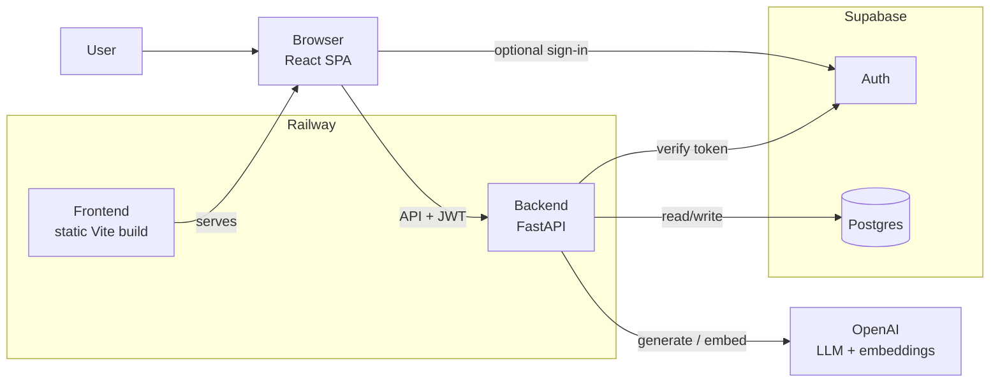

# Architecture

General system design for AI projects built from this template. This doc covers boundaries and deployment — not a specific product. For product-specific designs, see [patterns/](patterns/).

## Purpose

Every project shares the same structural rules:

- **Browser/UI** in `frontend/` — thin, no AI secrets
- **AI + business logic** in `backend/app/` — authoritative
- **Persistence + auth** in Supabase — when the product needs them
- **Local dev inputs** in `data/` — gitignored payloads

The project brief ([project-brief.md](project-brief.md)) decides which pieces you actually build.

## High-level shape

Not every project uses every box:

| Component | Skip when |
| --------- | --------- |
| Frontend | API-only MVP, CLI tool with optional admin UI later |
| Supabase Auth | Internal API with API keys, or no users yet |
| Postgres / Alembic | Stateless API, or in-memory/file-backed prototype |
| pgvector | No semantic search needed |
| OpenAI embeddings | Project uses LLM only (no retrieval) |

## Architectural goals

- **Backend owns AI.** All LLM calls, agents, retrieval, and grounding happen in FastAPI — never in the browser.
- **Frontend stays thin.** UI, local state, session management, API calls. No secrets.
- **Stateless backend.** Durable data lives in Supabase Postgres (or external storage you add). Railway runs stateless Uvicorn workers.
- **Typed boundaries.** Pydantic models at HTTP boundaries. PydanticAI for agent inputs/outputs when using agents.
- **Scripts stay separate.** Batch ingest, eval, and seed jobs live in `backend/scripts/` — not in the request path unless the product needs a trigger.

## System boundaries

### Frontend

| Responsibility | Location |
| -------------- | -------- |
| Render UI | `frontend/src/pages/`, `components/` |
| Client routing | `frontend/src/App.tsx` |
| Env validation | `frontend/src/lib/env.ts` |
| Supabase browser session | `frontend/src/lib/supabase.ts` |
| Backend HTTP calls | `frontend/src/lib/api.ts` |

Must NOT: OpenAI keys, service-role key, retrieval logic, direct DB access.

### Backend

| Responsibility | Location |
| -------------- | -------- |
| HTTP routes | `backend/app/api/` |
| AI / domain logic | `backend/app/<domain>/` |
| LLM client | `backend/app/llm/` |
| Auth verification | `backend/app/auth/` |
| DB models + queries | `backend/app/database/` |
| Batch / one-off jobs | `backend/scripts/` |

Must NOT: serve production frontend assets, expose service-role key to clients, trust unvalidated client input.

### Data

| Responsibility | Location |
| -------------- | -------- |
| Local corpus / fixtures | `data/corpus/` |
| Sample download scripts | `data/examples/` |

Must NOT: secrets, production PII, committed large payloads.

## Request flow (typical user-facing app)

1. User opens the React SPA.
2. If auth is enabled: user signs in via Supabase; frontend holds the session.
3. User action triggers an API call through `lib/api.ts` with `Authorization: Bearer <token>`.
4. FastAPI verifies the token, runs domain logic (possibly calling OpenAI), reads/writes Supabase.
5. Response returns as JSON (or streamed chunks for chat).
6. Frontend renders the result.

API-only projects skip steps 1–2 and call FastAPI directly.

## Auth

When the product has users:

- **Frontend:** Supabase anon key + `@supabase/supabase-js` for sign-in/sign-up.
- **Backend:** verify JWT on protected routes via `app/auth/dependencies.py`.
- **Service role:** backend only, for privileged writes tied to the authenticated user.

Email auth is the default. Extend only if the brief requires SSO/OAuth.

## Configuration

| Service | Settings module | Prefix |
| ------- | --------------- | ------ |
| Backend | `backend/app/config.py` | none |
| Frontend | `frontend/src/lib/env.ts` | `VITE_` |

Fail fast on missing required vars. No silent defaults that hide misconfiguration.

## Deployment (Railway)

Default: two services + hosted Supabase.

| Service | Command | Notes |
| ------- | ------- | ----- |
| Frontend | `pnpm build` → serve `dist/` | Static SPA |
| Backend | `uv run uvicorn app.main:app --host 0.0.0.0 --port $PORT` | Stateless API |

Environment variables mirror local `.env` files. Supabase stays hosted — do not self-host Postgres unless the brief requires it.

API-only projects may deploy backend only.

## Database

When using Postgres:

- Schema via SQLAlchemy models + Alembic migrations in `backend/`.
- Supabase dashboard is not the source of truth for tables.
- Migrations use the **direct** connection URL.
- Add `pgvector`, RLS, and indexes explicitly in migrations when needed.

## Error handling

Standard HTTP semantics:

| Code | When |
| ---- | ---- |
| 401 | Missing or invalid auth token |
| 403 | Authenticated but not allowed |
| 404 | Resource not found |
| 422 | Invalid request body |
| 502 | Upstream failure (OpenAI, Supabase) |
| 500 | Unexpected server error |

Frontend: friendly user messages; distinguish network/CORS errors from HTTP errors in `lib/http.ts`.

## Implementation order (general)

Adapt to your project type — this is a sensible default:

1. **Scaffold** — `backend/app/main.py` health check; frontend shell with routing (if needed).
2. **Config** — settings modules, `.env.example` files.
3. **Auth** — if user-facing: Supabase in frontend, JWT verify in backend.
4. **Core domain** — the main AI feature (classify, extract, chat, agent run, etc.).
5. **Persistence** — if needed: models, migrations, CRUD.
6. **UI** — pages that call the core domain.
7. **Scripts** — batch ingest, eval, or seed if the product needs offline processing.
8. **Deploy** — Railway services + env vars.

For a grounded RAG chatbot specifically, follow [patterns/grounded-rag-chat.md](patterns/grounded-rag-chat.md).

## Reference patterns

Optional detailed architectures for common project types:

| Pattern | Doc |
| ------- | --- |
| Grounded RAG chat with citations | [patterns/grounded-rag-chat.md](patterns/grounded-rag-chat.md) |

Add new patterns under `docs/patterns/` as the template grows.

## Non-goals (unless brief says otherwise)

- Next.js, SSR, or server components
- Direct OpenAI calls from the browser
- Multi-tenant SaaS scaffolding
- Self-hosted vector DB outside Supabase
- Mobile apps
